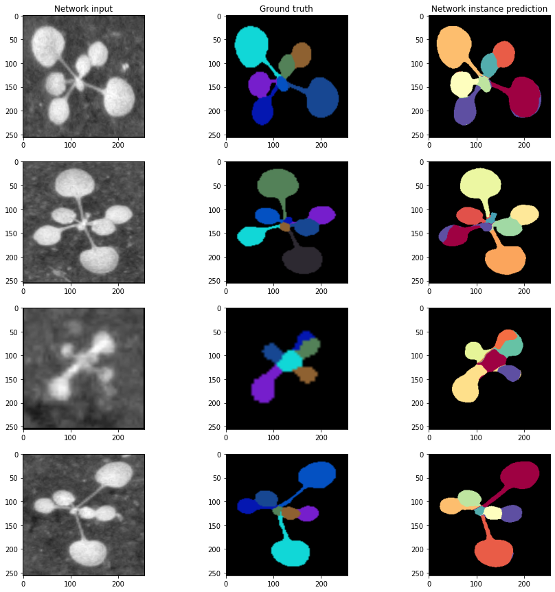

# Implementation of Semantic Instance Segmentation with a Discriminative Loss Function paper using Pytorch
This repository implements [Semantic Instance Segmentation with a Discriminative Loss Function](https://arxiv.org/abs/1708.02551) by pytorch.

## Currently implementing improvements over the original code

- Generic instance number support
- Fixed loss function implementation
- Support for CVPPP 2017 LSC dataset

## Reference
https://github.com/Wizaron/instance-segmentation-pytorch  
https://github.com/milesial/Pytorch-UNet  
https://github.com/davyneven/fastSceneUnderstanding
